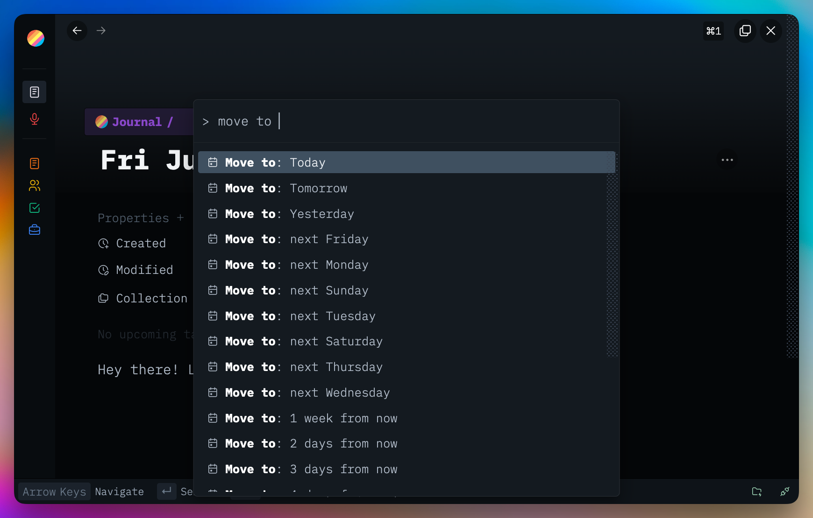

# Jump Move Send

Three families of date-targeted command-palette actions for Thymer. Jump to any journal day, move items to a journal day (with navigation), or silently send items to a journal day without moving your cursor.

Plugins are made with 🤍 for the Thymer community. Free to use, fork, and hack on for <a href="LICENSE" target="_blank" rel="noopener noreferrer">non-commercial use</a>.

Plug-ins take effort, hours, and credits to build. If you find them helpful for you and your workflows, a star ⭐ on the repo, a <a href="https://buymeacoffee.com/akaready" target="_blank" rel="noopener noreferrer">coffee</a> ☕, and a link back to <a href="https://akaready.com" target="_blank" rel="noopener noreferrer">@akaready</a> 🔗 all go a long way. Optional of course, but always appreciated.

Enjoy! 🙏

  

&nbsp;

## 📦 Install

**Recommended:** Use the <a href="https://github.com/ahpatel/thymer-plugins-manager" target="_blank" rel="noopener noreferrer">Thymer Plugins Manager</a> and install via <a href="https://github.com/akaready/thymer-[^"]*" target="_blank" rel="noopener noreferrer">this repo's URL</a> for auto updates.

**Manual:** copy <a href="plugin.js" target="_blank" rel="noopener noreferrer"><code>plugin.js</code></a> and <a href="plugin.json" target="_blank" rel="noopener noreferrer"><code>plugin.json</code></a> from this repo into Thymer's plugin editor.

&nbsp;

## ⌨️ Commands

Open Thymer's command palette and pick one. Every date target below ships in three flavors:

- **`Jump to: <date>`** — navigate to that day's journal page, leave content alone
- **`Move to: <date>`** — move the active/selected line(s) to that day, then navigate
- **`Send to: <date>`** — move the active/selected line(s) to that day silently, no navigation

Date targets:

- `Today`, `Tomorrow`, `Yesterday`
- `2 days from now` … `7 days from now`
- `1 week from now`, `2 weeks from now`, `3 weeks from now`
- `1 month from now` (calendar-month forward; JS overflow behavior — Jan 31 → Mar 3)
- `next Monday` … `next Sunday` (always lands on the **next** occurrence; if today is Monday, "next Monday" = +7 days)

Plus:

- `Jump Move Send: Undo Last Move` — reverses the most recent move/send
- `Plugin: Jump Move Send` — opens the settings panel

&nbsp;

## ➡️ What it moves

- If you have a text selection across one or more lines, all spanned line items move.
- If you only have a cursor in a line, that single line item moves.
- Selection is captured continuously via window-level event listeners plus a 300ms DOM poll, so opening the command palette won't lose it.
- The status bar shows the currently-tracked line's full guid (click to copy).

&nbsp;

## ✅ Reliability guarantees

- One operation at a time — fast palette mashing toasts `"busy — try again"` instead of racing.
- Intent (target line + active record) is snapshotted at command-fire time, so async hops can't change the target underfoot.
- After a successful move + navigate, the stash auto-clears (you must re-click a line to do another move). The 500ms post-navigate window suppresses auto-stashing so the destination's caret-landing-spot doesn't pollute it.
- Every move is verified by walking the destination record's children for the moved guid. If verification fails, the toast switches to an error instead of falsely claiming success.

&nbsp;

## 🎛️ Settings

- **Confirm before moving** (default off) — show a confirmation modal first.
- **Date offsets relative to visible journal page** (default off) — when on, `Tomorrow`, `next Monday`, `2 weeks from now`, etc. resolve from the journal day you're viewing instead of from today. Falls back to today if you're not on a journal page.
  - Also accessible via the **`Date: Today`** / **`Date: Journal`** status-bar button (click to toggle) and the **`Jump Move Send: Date base — …`** palette command.

Settings persist in localStorage, keyed per workspace.

&nbsp;

## 📊 Anonymous Usage Counter

This plugin pings a <a href="https://www.goatcounter.com/" target="_blank" rel="noopener noreferrer">privacy-respecting counter</a> on first install and once per day of active use. It exists so I can see which plugins are worth continuing to invest in — both "did anyone install it" and "is anyone still using it after a week." Combined with the coffee donations, this is what tells me whether to keep building. It tracks the plugin slug only, no other telemetry or user data, and you can see exactly what I see on the <a href="https://thymer-plugins.goatcounter.com" target="_blank" rel="noopener noreferrer">public dashboard</a>.

**Opt out:** Do Not Track, or `localStorage.setItem('tps-telemetry-opt-out','1')` in the console.
